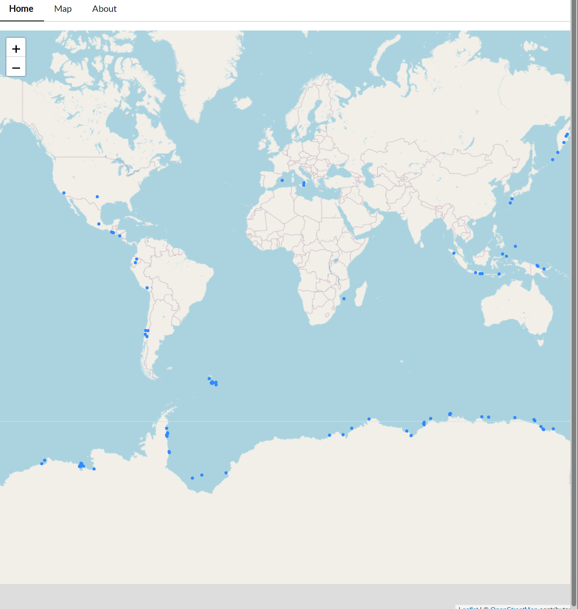

# nasa map

This is small web app which displays information about natural disasters from NASA's EONET api on a map. I made this project because I was interested in making something using a map.

## screenshot

